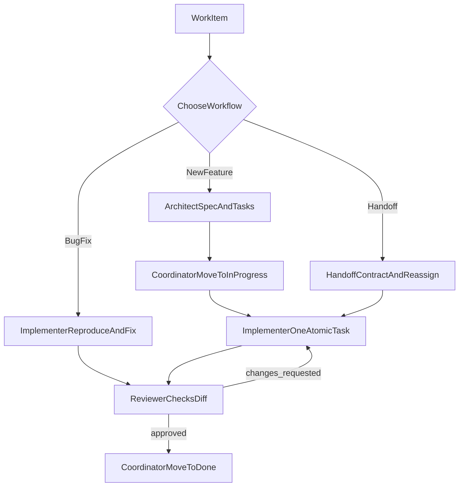

# Agent Workflows

Операційний SOP для агенто-незалежної AI-розробки: як вести задачу від ідеї до `done` через ролі, артефакти та перевірку.

---

## Purpose

- Дати відтворюваний процес, який працює незалежно від конкретного AI-інструмента.
- Стандартизувати послідовність `spec -> tasks -> implement -> review -> done`.
- Забезпечити передбачуваний handoff між агентами без опори на історію чату.

## Primary Audience

**Primary audience:** `Coordinator` (людина або orchestration-агент), який керує чергою задач і передає контекст ролям.

**Secondary audience:**
- `Architect` — готує/оновлює `spec.md`, `tasks.md`, `decisions.md`.
- `Implementer` — реалізує одну атомарну задачу у коді/тестах.
- `Reviewer` — перевіряє diff на відповідність docs-контрактам.

---

## Quick Start

1. Визнач тип роботи:
   - нова фіча -> **Workflow 1: New Feature**
   - баг/регресія -> **Workflow 2: Bug Fix**
   - зміна агента/інструмента -> **Workflow 3: Agent/Tool Handoff**
2. Підготуйте контекст:
   - `docs/architecture/*`
   - `docs/standards/*`
   - релевантні `docs/features/<feature>/*`
3. Призначте роль і очікуваний артефакт виходу.
4. Після кожного етапу оновіть `docs/tasks/*` і, за потреби, `decisions.md`.

---

## Role Matrix

| Role | Owns | Input | Output | Done criteria |
| --- | --- | --- | --- | --- |
| Coordinator | Пріоритезація, вибір workflow, передача контексту | Backlog, feature context, статуси | Оновлені `docs/tasks/*`, призначений next step | Є обрана задача, власник і ясний наступний крок |
| Architect | Специфікація та декомпозиція | Feature idea, architecture/standards, constraints | `spec.md`, `tasks.md`, `decisions.md` (за потреби) | Задачі атомарні з Input/Output/Constraints |
| Implementer | Виконання однієї задачі | Конкретний task, spec, decisions | Код/тести + оновлений статус задачі | Scope не порушений, перевірки пройдені, прогрес зафіксовано |
| Reviewer | Контроль якості та відповідності docs | Diff, task, spec, decisions | Findings + verdict (approve/changes requested) | Ризики покриті, критерії задачі виконані |

---

## Workflow 1: New Feature

### Trigger
Є нова функціональність, яку ще не описано або не декомпозовано.

### Steps by role
1. **Coordinator**
   - створює запис у `docs/tasks/backlog.md`
   - формулює scope і constraints
2. **Architect**
   - створює/оновлює `docs/features/<feature>/spec.md`
   - декомпонує у `docs/features/<feature>/tasks.md`
   - фіксує рішення у `decisions.md` (за потреби)
3. **Coordinator**
   - обирає одну атомарну задачу з `tasks.md`
   - переносить її в `docs/tasks/in-progress.md`
4. **Implementer**
   - реалізує задачу в межах spec/constraints
   - додає/оновлює тести
5. **Reviewer**
   - перевіряє diff проти `architecture/*`, `standards/*`, `spec.md`, `tasks.md`
   - повертає `approve` або `changes requested`
6. **Coordinator**
   - після approve переносить пункт у `docs/tasks/done.md`

### Artifacts updated
- `docs/features/<feature>/spec.md`
- `docs/features/<feature>/tasks.md`
- `docs/features/<feature>/decisions.md` (за потреби)
- `docs/tasks/backlog.md`
- `docs/tasks/in-progress.md`
- `docs/tasks/done.md`

### Exit criteria
- Реалізовано саме те, що визначено в поточному task.
- Тести/перевірки для зміненої поведінки виконані.
- Статуси й рішення зафіксовані в документації.

---

## Workflow 2: Bug Fix

### Trigger
Є дефект, регресія або нестабільна поведінка у вже існуючому функціоналі.

### Steps by role
1. **Coordinator**
   - фіксує дефект у backlog з мінімальними кроками відтворення
2. **Implementer**
   - відтворює проблему (`expected vs actual`)
   - визначає root cause і мінімальний scope виправлення
   - реалізує fix і додає/оновлює regression test
3. **Reviewer**
   - перевіряє відсутність побічних ефектів
   - звіряє diff з `architecture/*`, `standards/*`, API/state/UI правилами
4. **Coordinator**
   - після approve переносить пункт у `docs/tasks/done.md`
   - за потреби ініціює запис рішення в `decisions.md`

### Artifacts updated
- релевантний код/тести
- `docs/tasks/in-progress.md`
- `docs/tasks/done.md`
- `docs/features/<feature>/decisions.md` (якщо змінено підхід)

### Exit criteria
- Дефект стабільно не відтворюється.
- Regression test покриває первинний сценарій.
- Немає порушень architecture/standards.

---

## Workflow 3: Agent/Tool Handoff

### Trigger
Потрібно передати задачу іншому агенту або в інший AI-інструмент.

### Steps by role
1. **Поточний власник задачі**
   - готує handoff package (див. Handoff Contract)
2. **Coordinator**
   - призначає нового виконавця і цільову роль
   - оновлює статус у `docs/tasks/in-progress.md`
3. **Новий агент**
   - підтверджує розуміння task/status/remaining work
   - продовжує з останнього валідного кроку
4. **Reviewer або Coordinator**
   - валідує, що контекст не втрачено і робота відновлена коректно

### Artifacts updated
- `docs/tasks/in-progress.md`
- за потреби `docs/features/<feature>/decisions.md`
- handoff summary у робочому контексті задачі

### Exit criteria
- Новий агент продовжує роботу без додаткового “відновлення з чату”.
- Поточний статус, ризики і наступні кроки однозначно зафіксовані.

---

## Handoff Contract (minimum required)

Обов'язковий пакет передачі:
- Task ID / назва задачі
- поточний статус (`not started`, `in progress`, `blocked`, `review`, `done`)
- перелік змінених файлів
- що вже зроблено
- що лишилось
- ризики/блокери
- прийняті рішення (`decisions.md` або короткий summary)
- результати перевірок (`lint`, `test`, `build`, manual checks)

Правило: handoff має бути самодостатнім для продовження роботи без історії чату.

---

## Lifecycle Diagram

---

## Stage Checklists

### Before Start
- Прочитано релевантні `docs/architecture/*` і `docs/standards/*`.
- Обрано один workflow за типом роботи.
- Визначено конкретний task з чіткими Input/Output/Constraints.

### During Execution
- Активна тільки одна атомарна задача на одного Implementer.
- Scope не виходить за межі поточного task.
- Нетривіальні рішення фіксуються в `decisions.md`.

### Before Review
- Підготовлено стислий diff summary.
- Запущено релевантні перевірки (`lint/test/build`).
- Оновлено статус у `docs/tasks/in-progress.md`.

### Before Done
- Отримано `approve` або закриті всі `changes requested`.
- Пункт перенесено у `docs/tasks/done.md`.
- Залишено короткий контекст завершення (що закрито і чому).

---

## Related Docs

- `docs/agents/agent-rules.md`
- `docs/agents/prompts.md`
- `docs/context/roadmap.md`
- `docs/architecture/*`
- `docs/standards/*`
